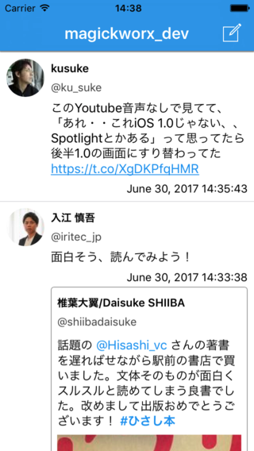

# TwitterDevKitSwift

## Features

- APIs to implement twitter client
- TDKTweet class for full parsed API response
- TDKTweetTableCell as Custom UITableViewCell class for tweet


### Supported REST APIs of Twitter

- 1.1/statuses/home_timeline
- 1.1/statuses/user_timeline
- 1.1/search/tweets
- 1.1/favorites/list
- 1.1/favorites/create
- 1.1/favorites/destroy
- 1.1/statuses/destroy
- 1.1/statuses/retweets


## Usage

```Swift
import TwitterDevKit

var tableView: UITabelView = UITableView()
var tableData: [AnyObject] = []

tableView.delegate = self
tableView.dataSource = self
tableView.backgroundColor = .white
tableView.rowHeight = UITableViewAutomaticDimension
tableView.estimatedRowHeight = 388
tableView.allowsSelection = true
tableView.separatorInset = UIEdgeInsets.zero
tableView.layoutMargins = UIEdgeInsets.zero
tableView.register(TDKTweetTableCell.self, forCellReuseIdentifier: "Tweet")
self.addSubview(tableView)

...

let account: ACAccount = "[set twitter account by ACAccountStore]"
let twitter = TDKTwitter(with: account)
let count = 100
let paramters = TDKHomeTimelineParameters(with: count)
twitter.getHomeTimeline(with: parameters, completion: {
  (timeline: TDKTimeline?, error: Error?) in
  if error == nil, let timeline = timeline {
    for tweet in timeline {
      self.tableData.append(tweet)
    }
    Dispatch.main.async() {
      self.tableView.reloadData()
    }
  }
})
```

## TwitterDevKitDemo

TwitterDevKitDemo is sample application using TwitterDevKit.framework.



## ToDo

## Known Bugs

- No detection for hashtags, links and mentions when tweet includes emoji.

## Requirements

 - Swift 3
 - iOS 10.3 or later
 - Xcode 8.3 or later

## License Agreement

Copyright (c) 2017, Kouichi ABE (WALL) All rights reserved.

Redistribution and use in source and binary forms, with or without
modification, are permitted provided that the following conditions are met:

 1. Redistributions of source code must retain the above copyright notice,
    this list of conditions and the following disclaimer.

 2. Redistributions in binary form must reproduce the above copyright notice,
    this list of conditions and the following disclaimer in the documentation
    and/or other materials provided with the distribution.

THIS SOFTWARE IS PROVIDED BY THE COPYRIGHT HOLDERS AND CONTRIBUTORS "AS IS"
AND ANY EXPRESS OR IMPLIED WARRANTIES, INCLUDING, BUT NOT LIMITED TO, THE
IMPLIED WARRANTIES OF MERCHANTABILITY AND FITNESS FOR A PARTICULAR PURPOSE ARE
DISCLAIMED. IN NO EVENT SHALL THE COPYRIGHT HOLDER OR CONTRIBUTORS BE LIABLE
FOR ANY DIRECT, INDIRECT, INCIDENTAL, SPECIAL, EXEMPLARY, OR CONSEQUENTIAL
DAMAGES (INCLUDING, BUT NOT LIMITED TO, PROCUREMENT OF SUBSTITUTE GOODS OR
SERVICES; LOSS OF USE, DATA, OR PROFITS; OR BUSINESS INTERRUPTION) HOWEVER
CAUSED AND ON ANY THEORY OF LIABILITY, WHETHER IN CONTRACT, STRICT LIABILITY,
OR TORT (INCLUDING NEGLIGENCE OR OTHERWISE) ARISING IN ANY WAY OUT OF THE USE
OF THIS SOFTWARE, EVEN IF ADVISED OF THE POSSIBILITY OF SUCH DAMAGE.

